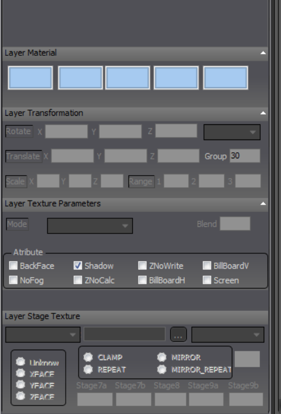

# 模型
## PVM格式
`.pvm` 格式是ATC4 唯一可读模型文件，可用`PVM Editor`编辑
文件内容实例（用vsc打开）：
```
Layer("jacket_leg2_h"){ 
Material(#00E8E8E8,#00000000,0,#00A0A0A0,#00000000) 
Mode("TEXTURE1") 
Group(2) 
Stage("NORMAL_SHADE","@d_rwy_jacket_01.dds",0,"REPEAT","MIPMAPANISOTROPIC","U
nkown") 
Face(2,1,0) 
Face(0,1,3) 
...
Vertex([0.70009,-16.4,0.70004],[0.69636,0.17365,0.69636],[0.21093,0.71094]) 
Vertex([0.70009,-6.4,-0.69997],[0.69636,0.17365,-0.69636],[0.11718,0.39844]) 
...
}
···
"jacket_leg2_h"：组件名称 
Mode("TEXTURE1")：单张贴图 
Mode("TEXTURE2")：两张贴图 
Group(2)：渲染层级 
Stage("NORMAL_SHADE","oasis_02.bmp",0,"REPEAT","LINEAR","Unkown") 
NORMAL_SHADE 贴图模式 
oasis_02.bmp 贴图（仅支持24 位.bmp 或DXT3 的.dds） 
REPEAT：重复 
Face：面 
Vertex：点
```


> 具体内容见PVM Editor

### 关于渲染层级 Group
```ATC4\PORT\RJTT\port.ini```中的描述
```ini
[RENDER] 
sea=1,2,3 
ground=4,5,6,7,8,10,11,12,13,14,15,16,17,18,19 
building=20,21,22,23,24,25,26,27,28 
```
具体渲染层级见下图

## MODEL
机场和周围地形的模型文件，位于`ATC4\PORT\Rxxx\MODEL`

> 谁以后引用

## MiscObjec
负责停车场内的车辆，电车单轨，海上船只等模型，位于`ATC4\PORT\Rxxx\APL\MiscObject`
```ini
[COLORPOWER] 
Night=120 
Light=130 
 
[OBJECT_INFO] 
ANCHORING=3    //有几个固定模型就填几个// 
MOVING=3      //有几个移动模型就填几个// 
MOVING_MINIMUM=0 
 
//----parkedCar-24Hours---------------------------// 
 
[ANCHORING_00] 
name=parkedCar_01 
density=30 
model_00=Car\Mdl_ParkedCar_nl\  //.pvm 模型文件所在文件夹// 
modelActDir=Car\dll\ 
modelActFile=Car.uact 
pointFile=4 
point00=Car\point_parkingcar_01.pnt   //模型点位文件的路径// 
timeAppear=06:00    //出现时间，可不填// 
timeDisappear=22:00    //消失时间，可不填// 
restDisappear=10 
 
[ANCHORING_01] 
name=parkedCar_02 
density=30 
model_00=Car\Mdl_ParkedCar_nl\ 
modelActDir=Car\dll\ 
modelActFile=Car.uact 
pointFile=4 
point01=Car\point_parkingcar_02.pnt 
timeAppear=06:00 
timeDisappear=22:00 
restDisappear=10 
 
[ANCHORING_02] 
name=parkedCar_03 
density=30 
model_00=Car\Mdl_ParkedCar_nl\ 
modelActDir=Car\dll\ 
modelActFile=Car.uact 
pointFile=4 
point02=Car\point_parkingcar_03.pnt 
timeAppear=06:00 
timeDisappear=22:00 
restDisappear=10
```
点位文件`point_XXXX.pnt`
```ini
[HEADER] 
count=723 
[POINT] 
36.6261,0,-25.0826,240.7102,RANDOM, 
39.0518,0,-18.8279,59.9935,RANDOM, 
X,Y,Z,朝向,模型文件名（RANDOM 随机抽取模型摆放）, 
X,Y,Z,Heading,Filename(can be random),
```